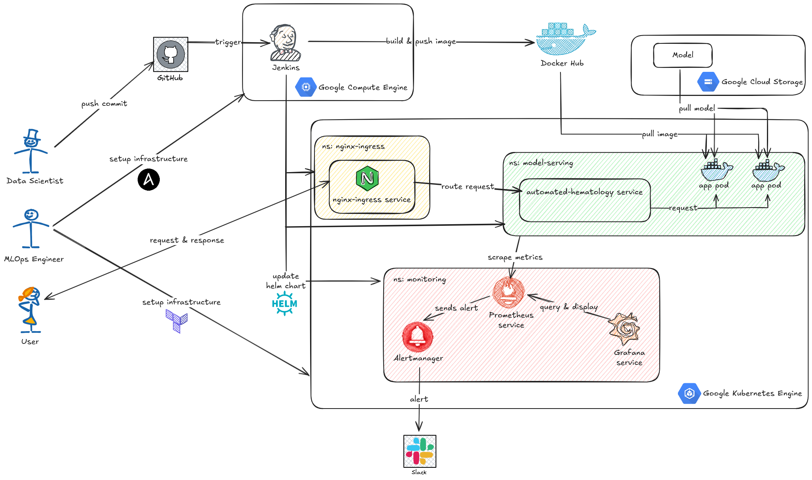

# Automated Hematology System

**An End-to-End MLOps Platform for Automated Blood Cell Detection and Classification**

## Project Overview

The **Automated Hematology System** is a production-grade MLOps project designed to automate the detection and classification of blood cells from microscopic images. This system addresses the need for rapid, consistent, and accurate hematological analysis, reducing the workload on laboratory technicians and minimizing human error.

This repository implements a complete **MLOps lifecycle**, featuring:

- **Continuous Integration (CI)**: Automated testing and containerization.
- **Continuous Deployment (CD)**: Automated deployment to Google Kubernetes Engine (GKE) using Helm.
- **Continuous Training (CT)**: (Infrastructure ready) Pipelines for model retraining and evaluation.
- **Model Serving**: Scalable REST API using FastAPI.
- **Monitoring**: Real-time system and model health tracking with Prometheus and Grafana.

## Architecture



### Tech Stack

- **Machine Learning**: PyTorch, Albumentations, OpenCV
- **Experiment Tracking**: MLflow
- **Model Serving**: FastAPI, Uvicorn
- **Containerization**: Docker
- **Orchestration**: Kubernetes (GKE), Helm
- **CI/CD**: Jenkins
- **Infrastructure as Code**: Terraform, Ansible
- **Monitoring**: Prometheus, Grafana, Alertmanager

## Key Features

- **Automated Model Training**: Configurable training pipelines using YAML.
- **Scalable Inference API**: High-performance FastAPI server for real-time predictions.
- **GitOps-style Deployment**: Helm charts for application and monitoring stack management.
- **Infrastructure Automation**: Ansible playbooks for instance provisioning and Terraform for GKE cluster management.
- **Observability**: Integrated Prometheus metrics for monitoring API latency, request counts, and system resources.

## Project Structure

```text
.
├── config/                 # Configuration files for training and inference
├── docker/                 # Dockerfiles for application and Jenkins agents
├── helm/                   # Helm charts for application and monitoring
│   ├── apps/               # Application specific charts
│   └── monitoring/         # Prometheus/Grafana charts and rules
├── iac/                    # Infrastructure as Code
│   ├── ansible/            # Ansible playbooks
│   └── terraform/          # Terraform configurations
├── models/                 # Directory for saving trained models
├── notebooks/              # Jupyter notebooks for experimentation
├── src/
│   └── ahs/                # Source code package
│       ├── api/            # FastAPI application
│       ├── cli/            # Command-line interfaces
│       ├── data/           # Dataset loading and processing
│       ├── models/         # Model architecture definitions
│       ├── training/       # Training loop and engine
│       ├── transforms/     # Image augmentations
│       └── utils/          # Utility functions
├── Jenkinsfile             # Jenkins CI/CD pipeline definition
├── Makefile                # Command shortcuts for common tasks
└── README.md               # Project documentation
```

## Setup & Installation

### Prerequisites

- Python 3.10+
- Docker & Docker Compose
- `gcloud` CLI (for GCP deployment)
- `kubectl` & `helm` (for Kubernetes management)

### Environment Setup

1.  **Clone the repository:**

    ```bash
    git clone https://github.com/yourusername/automated-hematology-system.git
    cd automated-hematology-system
    ```

2.  **Create a virtual environment:**

    ```bash
    python -m venv venv
    source venv/bin/activate
    ```

3.  **Install Dependencies:**
    Dependencies are managed directly via `pip`. Refer to the `docker/Dockerfile` for the definitive list, or install common packages:
    ```bash
    pip install torch torchvision opencv-python albumentations mlflow fastapi uvicorn
    ```

## Usage

### Data Preprocessing & Training

The system uses configuration files in `config/` to control hyperparameters.

To start training using the default configuration (`config/train.yaml`):

```bash
make train
# Or manually:
python -m src.ahs.cli.train_cli
```

### Model Inference

Run inference on a single image or batch of images:

```bash
make infer
# Or manually:
python -m src.ahs.cli.infer_cli --img_path path/to/image.jpg
```

### Model Serving (Local)

Start the FastAPI server locally for development:

```bash
make api
```

The API documentation will be available at `http://localhost:8000/docs`.

## MLOps Pipeline

The project utilizes **Jenkins** for orchestration. The pipeline `Jenkinsfile` defines the following stages:

1.  **Test**: Runs unit tests (e.g., `pytest`) in a Dockerized environment.
2.  **Build & Push**: Builds the Docker image and pushes it to Docker Hub.
3.  **Auth to GKE**: Authenticates with Google Cloud Platform.
4.  **Deploy**:
    - Updates the Kubernetes deployment using **Helm**.
    - Deploys/Updates the **Prometheus** monitoring stack.
    - Applies alerting rules.

## Results & Monitoring

The system includes a comprehensive monitoring stack.

- **Prometheus**: Scrapes metrics from the application (exposed via `/metrics`) and Kubernetes nodes.
- **Grafana**: Visualization dashboards for API performance (RPS, Latency) and Node health (CPU, Memory).
- **Alerting**: Slack notifications are configured for critical events (via Alertmanager).

To view metrics (locally via port-forwarding):

```bash
kubectl port-forward svc/prometheus-operated 9090:9090 -n monitoring
```

## Contributing

Contributions are welcome! Please follow these steps:

1.  Fork the repository.
2.  Create a feature branch (`git checkout -b feature/AmazingFeature`).
3.  Commit your changes following the [Conventional Commits](https://www.conventionalcommits.org/) specification.
4.  Push to the branch.
5.  Open a Pull Request.

## License

Distributed under the MIT License. See `LICENSE` for more information.
