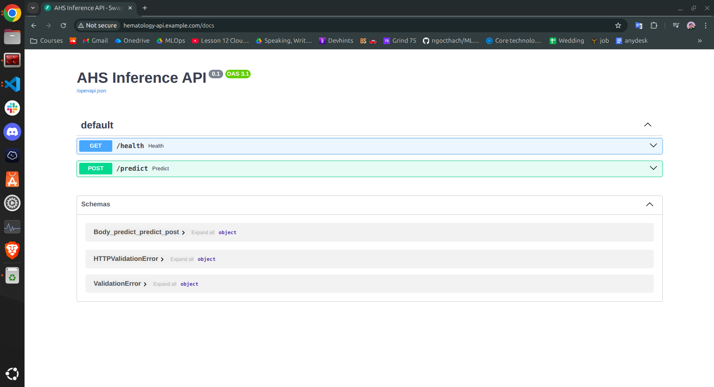

## How-to Guide
### 1. NGINX
First, your user needs to have cluster-admin permissions on the cluster. This can be done with the following command:

```shell
kubectl create clusterrolebinding cluster-admin-binding \
  --clusterrole cluster-admin \
  --user $(gcloud config get-value account)
```
, then, the ingress controller can be installed like this:

```shell
kubectl apply -f https://raw.githubusercontent.com/kubernetes/ingress-nginx/controller-v1.14.1/deploy/static/provider/cloud/deploy.yaml
```
For private clusters, you will need to either add a firewall rule that allows master nodes access to port `8443/tcp` on worker nodes, or change the existing rule that allows access to port `80/tcp`, `443/tcp` and `10254/tcp` to also allow access to port `8443/tcp`.

### 2. App-api
```shell
helm upgrade  --install hematology-api helm/apps/hematology-api -n model-serving --create-namespace
```

### 3. Domain + hostfile (local machine)
```shell
sudo vim /etc/hosts
```
,then add: `34.87.158.244 hematology-api.example.com`.

bingo, you can access app via: `http://hematology-api.example.com:80/docs`.

