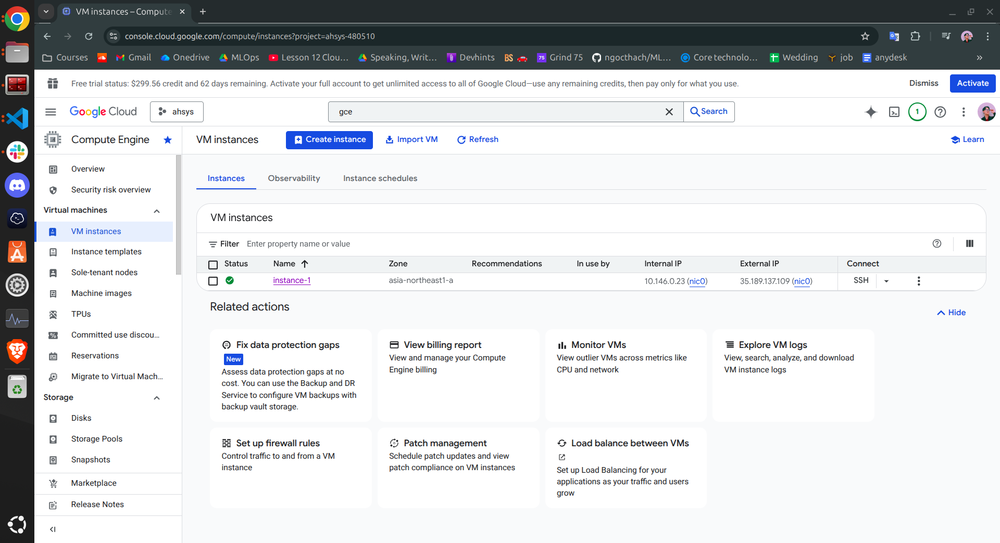
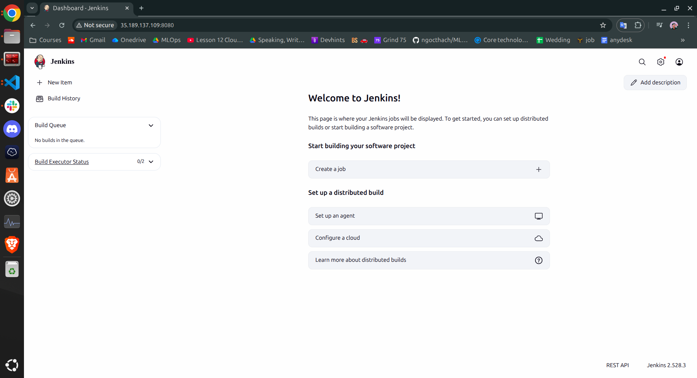

## How-to Guide
### 1. Install prerequisites
```shell
pip install -r requirements.txt
```

### 2. Create your secret file
After creating, please replace mine at `secrets/*.json`


### 3. Run some more complicated playbooks
#### 3.1. Provision the server and firewall rule
```shell
cd iac/ansible
ansible-playbook create_compute_instance.yaml
```

**Note:** Update `state: absent` to destroy the instance

#### 3.2. Install Docker and run the application
After your instance has been started as the folowing image, get the External IP (e.g., `35.189.137.109` as in the example) and replace it in the inventory file


, and run the following commands:
    
```shell
ansible-playbook -i ./inventory install_and_run_docker.yml
```
, now you should be able to access your jenkins via `http://35.189.137.109:8080`
