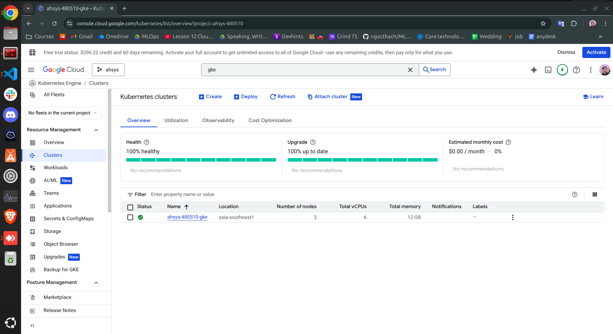

### Install Terraform for Ubuntu 22.04

https://computingforgeeks.com/how-to-install-terraform-on-ubuntu/

## How-to Guide

Authenticate with GCP

```shell
gcloud auth application-default login
```

## Provision a new cluster

```shell
cd iac/terraform
terraform init
terraform plan
terraform apply
```
